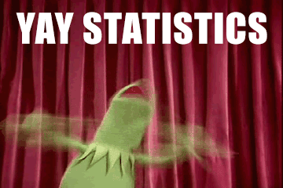

```{r setup, include=FALSE}
knitr::opts_chunk$set(echo = TRUE)
```

## About me

* B.S., M.S., and Ph.D. in Applied Statistics
* Worked in the WSU SCC for a tear
* Spent the last two as the lead Data Scientist over at the School of Aerospace Medicine
* Currently work in the Data Science Lab at AFIT


# What is statistics?


## Statistics

* The science of data collection and analysis!
* The sexier term is now *Data Science*

<center></center>


## Design

Before analyzing the data, the data needs to be collected. Thus, statistics also encompasses the science of collecting data.

* **Sampling design** is the branch of statistics that focuses on collecting observational data
* **Experimental design** is the branch of statistics that focuses on collecting data through experiments, like in a laboratory


## Biostatistics

* Statistics applied to biological experiments, especially in medicine, pharmacy, agriculture and fishery
* Has seen enormous growth in recent years
* Use in high-throughput data
* New biomedical technologies like **microarrays**, next generation **sequencers** (genomics) and **mass spectrometry** (proteomics) generate massive amounts of data
* Surge in new statistical methodology to deal with these "massive" data sets
* Thousands of statistical tests are often performed (false discovery rates)


## Statistical software

* [R](https://www.r-project.org/)
* [RStudio](https://www.rstudio.com/)


## Populations and samples

* The primary goal of statistics is to infer something about a **population** based on a **sample** obtained from the population (typically at random)
* Populations may be very large (or even hypothetically infinite in size)
* Often impossible or impractical to observe every object in the population
* With statistics we can make accurate statements about the population using a sample (even a very small one!)


## How many observations should one collect?

* Think of data as evidence
* The more data we have, the more information we have
* However, data collection can be expensive and time consuming (e.g., pharmaceutical studies)
* Determining "optimal" sample size is important in any study, and quite simple once all of the following are specified:
    - smallest effect of **clinical significance**
    - desired **power** ($1 - \beta$) and **significance level** ($\alpha$)
    - distributions of the observables
    - whether a one- or two-sided test will be used
    

## Statistical models

The scientific question that one hopes to investigate using statistical analysis can usually be formalized using statistical models. We shall use the following example to illustrate a simple models.

```{r}
data(Animals, package = "MASS")  # brain and body weights for 28 species of land
head(Animals)                    # animals
```


## Statistical models

```{r, fig.width=8, fig.height=4}
par(mfrow = c(1, 2))  # setup to place the following plots side-by-side
plot(Animals)  # plot the first column (x-axis) vs. the second column (y-axis)
plot(Animals, log = "xy")  # transform both variables by taking the natural log
```


## Statistical models {.smaller}

```{r}
slr <- lm(log(brain) ~ log(body), data = Animals)  # fit a simple linear model
summary(slr)  # print a summary of the fitte model
```


## Statistical models {.smaller}

```{r, fig.width=4, fig.height=4}
plot(log(brain) ~ log(body), data = Animals)  # plot the data
abline(slr, col = "red", lwd = 2)  # plot the fitted regression line
```


## Statistical models

A simple formula to predict brain weight (g) from body weight (kg) using the previously fitted regression model is

$$
\hat{\log\left(brain\right)} = 2.555 + 0.496 \log\left(body\right)
$$


## Statistic

* A statistic is a number that is computed from the data in a (random) sample 
* They can be computed by plugging the data into a formula that does not require knowing the true
parameter values of the population of interest
* One of the simplest examples of a statistic is the arithmetic mean: 
$$\bar{x} = \frac{x_1 + \dots + x_n}{n}$$
* Other examples include the median, variance, MAD, IQR, and the estimated intercept/slope of a regression line
